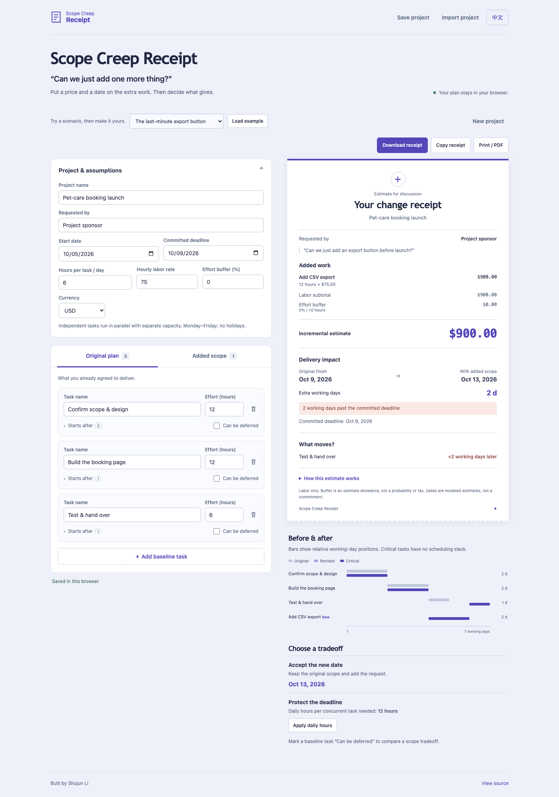

# Scope Creep Receipt

**Turn “can we just add one more thing?” into a receipt people can discuss.**

[Live demo](https://lsj0914.github.io/scope-creep-receipt/) · [中文说明](README.zh-CN.md) · [Calculation methodology](docs/methodology.md)



An extra feature has two different costs: the work it adds and the delivery commitments it changes. Scope Creep Receipt estimates both, explains the dependency impact, and offers concrete tradeoffs. It runs entirely in your browser, without an account or an API key.

## A five-day plan, one small request

The default example starts on Monday, October 5, 2026. Scope/design takes 12 hours, building takes 12 hours, and testing/handover takes 6 hours. At six hours per task per day, the original sequential plan finishes Friday, October 9.

Now add a 12-hour CSV export after building and before handover:

| Result               | Estimate                                 |
| -------------------- | ---------------------------------------- |
| Added labor          | 12 hours                                 |
| Hourly rate          | $75                                      |
| Buffer               | 0%                                       |
| Incremental cost     | **$900**                                 |
| Original finish      | October 9, 2026                          |
| Revised finish       | **October 13, 2026**                     |
| Original tasks moved | Testing/handover, two working days later |

Try the **parallel data glossary** example: it also adds $900 of work, but the original finish date stays the same. Try the **workshop tradeoff** example: deferring the optional social media pack restores the original deadline.

## Use it

1. Load an example or start a new project.
2. Enter baseline tasks, estimated labor hours and predecessor links.
3. Add the requested work. Set **Starts after** for its predecessors and **Blocks existing tasks** for tasks that must wait for it.
4. Read the itemized cost, delivery impact, moved tasks and before/after timeline.
5. Compare a later date, more daily time per task, or deferring optional scope.
6. Download/copy the Markdown receipt, print it to PDF, or save the project JSON for later.

### Features

- Editable baseline and added-work tasks with dependency-cycle detection.
- Critical-path/slack calculation and downstream finish-date impacts.
- Working-day calendar that skips weekends, including across daylight-saving changes.
- Itemized labor and explicit effort-buffer estimates; USD, CNY, EUR and GBP.
- Deadline alternatives with honest infeasibility messages.
- Optional task deferral that preserves retained predecessor constraints.
- English/Chinese interface, mobile layout, keyboard navigation and accessible labels.
- Browser-local drafts; versioned JSON import/export and three downloadable [example files](examples).
- Markdown and clipboard exports; receipt-only print/PDF layout with calculation assumptions.

## What the model assumes

This is a small decision-support tool, not a staffing optimizer or a probabilistic forecast.

```text
task duration = ceil(hours × (1 + buffer / 100) / daily hours)
task start    = latest finish among its predecessors
change cost   = added hours × (1 + buffer / 100) × hourly rate
```

**Daily hours are available to each concurrent task separately.** Independent tasks can run in parallel; the tool does not allocate a shared team or resolve resource conflicts. Apply the capacity alternative only if that time really is available for each concurrent task. An effort buffer is an allowance, not a confidence interval.

The calendar uses Monday–Friday, not local public holidays. Durations round up to whole working days, so finish-date changes can be discontinuous. Costs include labor only. Both original and revised plans use the same current assumptions; changing daily hours recalculates both. See [methodology](docs/methodology.md) for exact date conventions, alternatives and boundaries.

## Privacy

Project inputs remain in this browser's `localStorage` unless you choose to download, copy or print them. The application makes no API calls, has no analytics and loads no external fonts. GitHub Pages serves the application's static files; ordinary hosting requests still occur. Browser storage is not encrypted, so use synthetic examples for public demonstrations and avoid putting sensitive work into a shared browser.

Invalid intermediate edits are kept on screen but are not written over the last valid saved draft. The interface marks them as unsaved and pauses exports until corrected. Save JSON to retain a portable copy.

If a saved draft cannot be opened, its original text is preserved until you explicitly replace it. Download the original from the recovery banner to attempt a repair. Portable projects are limited to 250 KiB; exports use compact JSON so accepted projects can be reimported.

## Run locally

Use **Node.js 22.12+ in the 22 LTS line, or Node.js 24+**, with npm.

```bash
npm ci
npm run dev
```

Open the local URL printed by Vite.

```bash
npm test                         # hand-derived engine/document fixtures
npm run build                    # strict typecheck and static production build
npx playwright install chromium  # once per development machine
npm run test:e2e                  # desktop and mobile browser checks
npm run check                    # all of the above checks
```

## How it is built

| File               | Responsibility                                                             |
| ------------------ | -------------------------------------------------------------------------- |
| `src/engine.ts`    | Input validation, dependency scheduling, working-day math and alternatives |
| `src/model.ts`     | Project and receipt contracts                                              |
| `src/editor.ts`    | Editable task and assumption controls                                      |
| `src/receipt.ts`   | Itemized receipt, timeline and tradeoff presentation                       |
| `src/documents.ts` | Validated JSON import, text escaping and document exports                  |
| `src/i18n.ts`      | English/Chinese copy and date/currency formatting                          |
| `src/main.ts`      | User actions, local persistence and print lifecycle                        |

TypeScript + Vite, without a runtime UI framework. Vitest exercises literal, hand-checked fixtures; Playwright checks real editing and downloaded files at desktop and mobile widths. axe-core checks the initial rendered interface for accessibility violations. These automated checks complement visual inspection; they are not a guarantee of complete accessibility.

[Quality checks](https://github.com/lsj0914/scope-creep-receipt/actions/workflows/ci.yml) run on pushes and pull requests. The [demo deployment](https://github.com/lsj0914/scope-creep-receipt/actions/workflows/deploy.yml) builds and publishes `main` to GitHub Pages.

## Why this project

Built by **Shujun Li** to explore the overlap between industrial engineering, project management and product design: make a small operational decision easier to explain, keep the math inspectable, and let the user make the tradeoff.

Released under the [MIT License](LICENSE).
